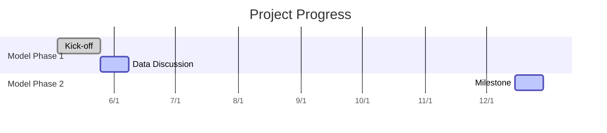

# 數位貸款 CFT x 產學合作
###### tags: `info` `note`
---

## Logistic

### Meeting channel
- [This HackMD](https://hackmd.io/UAZjUsvnQSKARtNsiKIgGQ?view)
- [Google Meet](https://hangouts.google.com/hangouts/_/calendar/azRqYWx1bHMyam02MmlkcHE3ZG8xNHZhNmtAZ3JvdXAuY2FsZW5kYXIuZ29vZ2xlLmNvbQ.46272qnb89drrimi6u2kgtv707)

---

<!-- [TOC] -->

## 5/4/2020 3-4pm

### 與會人
- 中研院：王釧茹老師、匡顯吉、張嘉元、簡伯銓
- 玉山銀行：晨揚經理、倚任副理、甫璋、冠吉、品瑜(會議記錄)

### 今日議程
1.	專案簡介(introduction)
2.	專案目標(objectives)
3.	衡量標準(metrics)
4.	現有模型成效(if any, current model performance)
5.	資料來源(data resource)
6.	會議規劃(meeting schedule)
7.	討論(discussion)

### 專案簡介
> 在Facebook廣告通路上，提供曾經瀏覽過玉山網頁的顧客所需要的產品/服務。現行的fb投放名單篩選機制是根據顧客的網頁瀏覽行為，透過人工定義的條件篩選得出，惟此方法的篩選機制需要人工判斷，此專案希望可以藉由機器學習方法，降低人工調整名單的成本，提升名單轉換率，並發現活躍顧客的重要特徵。

### 專案目標
藉由機器學習模型(方法不限)，產出信貸以及卡友貸合適的行銷名單，定義合適的衡量標準，追蹤模型成效。

舉例：
現行的篩選條件
- 60天內看過信貸(卡友貸)網頁
- 60天內信貸試算有結果但未送件
- 60天內申請信貸(卡友貸)未送件
- 60天內進到信貸試算第1頁未送件
- 45天內看過理財相關網頁
- ...

### 衡量標準
- 業務：名單轉換率
- Baseline模型：若以分類問題來建模，建議使用AUC
- Deep Learning模型：其他合適的對應衡量方法

### 現有模型成效
- 無(僅有2018年的舊模型相關檔案)

### 資料來源(data resource)
- 透過Google Cloud Platform(GCP)Storage提供
- 建模時間區間：2019年11月1日-2020年4月30日
- 母體：[ClientID, or 瀏覽器ID](https://www.owox.com/blog/use-cases/google-analytics-client-id/)
- x值：欄位解釋：[Table schema](https://support.google.com/analytics/answer/3437719?hl=en)
- y值：點選至信貸(卡友貸)相對應頁面
    - 信貸：/s/PersonalLoanApply/Attachment/Upload
    - 卡友貸：/EsunCreditweb/txnservice/mlapsend

### 會議規劃(meeting schedule)
- 建議初期每兩週一次例會，開始建模後視情況調整為每三到四週一次例會

### 討論(discussion)
- 樣本蒐集定義? 是進入玉山官網還是特定頁面?
    - 樣本為每天造訪玉山官網的顧客的Log紀錄，載具包含手機、電腦、平板，留存的格式都一樣，為不同的瀏覽器會有不同的clientID。 
- Y值定義? 觸發行為後多久進到申請頁面?
    - Y值定義:
        - 信貸線上申請：  /s/PersonalLoanApply/Attachment/Upload
        - 卡友貸線上申請：  /EsunCreditweb/txnservice/mlapsend
    - 觸發行為定義:
        - 現行的rule-based方法，是在GA或是Facebook後台設定條件，如果瀏覽過預先定義的頁面就會進入名單30天(或是可設定的天數)
- 資料細節(待實作時更新)：
    - Y值0和1的比例?
    - Training和Testing Data怎麼切?
- 模型實作：
    - 玉山負責feature engineering和使用tree-based model(LightGBM)作為baseline
    - 中研院負責Deep Learning Based Model，倚任副理建議可加入sequential或graph embedding

### 待辦(to-do)
- 保密協議
- 本周(5/8前)將資料交付給中研院
    - 資料說明:
        - 範例樣本為2020/1/1，一小群顧客的資料樣貌
        - 2020年4月間(2020/4/1-4/30)顧客曾經造訪特定頁面即為y=1(y值定義如下)
        - clientId(y=0): 2020年4月間(2020/4/1-4/30)，**未曾造訪**特定頁面的顧客Id
        - 由於clientID是瀏覽器ID(clientId)，二月的clientId在一月時可能還不存在;或是一月存在的clientId，二月已經被清除了
            - clientId(y=1): 2020年4月間(2020/4/1-4/30)，曾經造訪特定頁面的顧客Id
            - 登入log資訊即為含有特徵以及標籤值(pagePath)的顧客造訪log軌跡
        - 登入Log資訊 2020/01 (y=0)：代表四月中未曾造訪特定頁面的顧客，在1月間的log瀏覽足跡
        - 特徵解釋請參考官方說明([BigQuery Export schema](https://support.google.com/analytics/answer/3437719?hl=en))
            - 舉例：提供資料中的pageviews欄位即為BigQuery中的totals.pageviews	

    - y值定義(pagePath):
        - 信貸線上申請：  /s/PersonalLoanApply/Attachment/Upload
        - 卡友貸線上申請：  /EsunCreditweb/txnservice/mlapsend
    - 建模資料
        - [範例樣本(一天) 277 KB](https://storage.cloud.google.com/cft_shared/v01_demo_features_y_in_one_day)
        - [clientId(y=0) 120,000筆, 2.46 MB](https://storage.cloud.google.com/cft_shared/v01_id_random_y0_202004)
        - [clientId(y=1) 11,007筆, 230 KB](https://storage.cloud.google.com/cft_shared/v01_id_all_y1_202004)
        - [登入Log資訊 2020/01 (y=0) 561 MB](https://storage.cloud.google.com/cft_shared/v01_selected_y0_features_y_range_2020_01)
        - [登入Log資訊 2020/02 (y=0) 686 MB](https://storage.cloud.google.com/cft_shared/v01_selected_y0_features_y_range_2020_02)
        - [登入Log資訊 2020/03 (y=0) 933 MB](https://storage.cloud.google.com/cft_shared/v01_selected_y0_features_y_range_2020_03)
        - [登入Log資訊 2020/04 (y=0) 1.2 GB](https://storage.cloud.google.com/cft_shared/v01_selected_y0_features_y_range_2020_04)
        - [登入Log資訊 2020/01-04 (y=1) 761 MB](https://storage.cloud.google.com/cft_shared/v01_y1_features_y_range_2020_01to04)

## Collaboration
- [Dr. Chuan-Ju Wang ](https://www.citi.sinica.edu.tw/pages/cjwang/index_zh.html)
- [Research Labs](https://cfda.csie.org/)

--- 
## Archive
### Data related
- Q1: Data size and seasonality
    - Size: For raw data for one day, 1.33GB, 275,417 rows 
    - Seasonality: N/A
- Q2: Check compliance and regulation
    - It should be okay since there is no personal info in GA data set
- Q3: Deliver result
    1. identify critical feature 
    2. workflow in GA

### Project related
1. 定期: 同步提供
1. 目標商品: 信貸以及卡友貸
1. 行銷名單: 瀏覽器ID(customDimention)
1. 衡量標準: AUC分類問題(classification, 0/1)
1. 追蹤成效: 後續與業務發展部越虹討論(過去為dashboard)
1. 資料來源: 透過GCP提供中研院王老師資料

### Question set
- Q1 產品類型？
    - 特徵X
        - 目前條件皆為人工定義，請問資料來源只有GA資料嗎？
            - YES, 不需外接資料
    - 標籤Y
        - 貸款相關：除了信貸、卡友貸還有其他貸款商品嗎？
            - 此專案範疇以信貸及卡友貸為優先考慮項目　
    - 欄位分類
        * visitorId
        * visitNumber
        * visitId
        * visitStartTime
        * date
        * totals
        * trafficSource
        * device
        * geoNetwork
        * customDimensions
        * hits
        * fullVisitorId
        * userId
        * clientId
        * channelGrouping
        * socialEngagementType

- Q2 資料來源？
    - 這些資訊是否已經留存於BigQuery內
        - YES
- Q3 問題延伸
    - 串接外部資料可行性